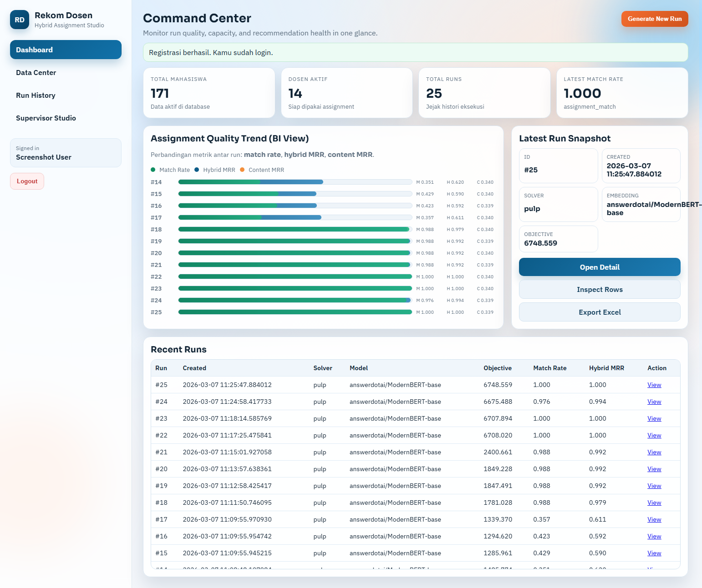
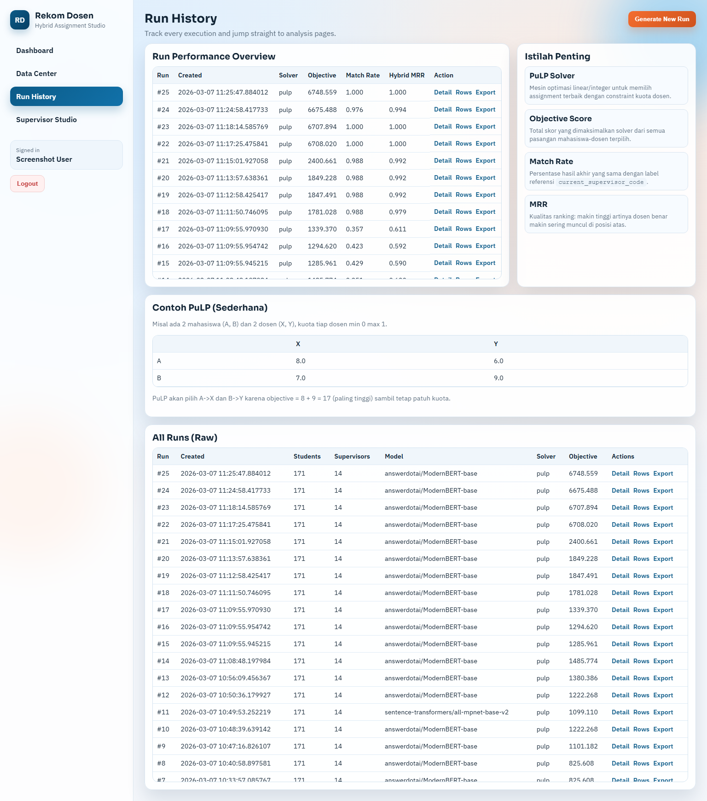
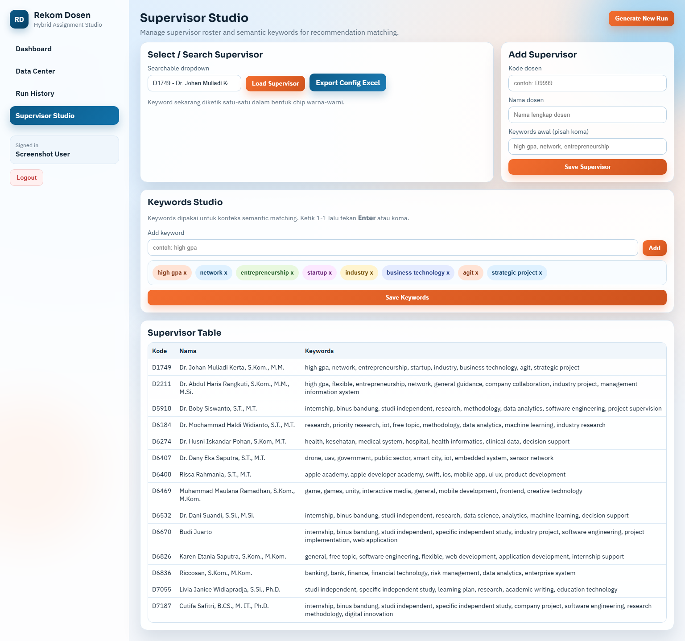

# faculty-recommender

Sistem Rekomendasi Dosen Pembimbing

Sistem ini membuat mapping mahasiswa ke dosen pembimbing dengan pendekatan hybrid:

- content-based berbasis `transformer embedding` + `cosine similarity` (gaya skripsi),
- rule-based booster sesuai aturan dosen,
- multilabel supervisor profiling (static + adaptive dari histori mapping),
- login/register berbasis web session untuk akses dashboard,
- manajemen kategori dosen (track/industry) langsung dari web,
- capacity balancing (target 10-12 mahasiswa per dosen),
- grouping perusahaan yang sama,
- API (`FastAPI`), web (`Flask`), database (`SQLite`), dan export Excel.

## Algoritma Content-Based (Transformer)

Pipeline content-based:

1. Gabungkan fitur teks mahasiswa (`track`, `partner/lecturer`, `position/topic`, `work schema`).
2. Bentuk dokumen profil dosen dari nama + kata kunci keahlian.
3. Encode dokumen dengan model transformer (`ModernBERT` default) menjadi embedding.
4. Hitung `cosine similarity` antar embedding mahasiswa-dosen.
5. Lanjutkan dengan rule boosting + optimasi assignment kuota.

Catatan multilabel fleksibel:

- tiap dosen punya banyak label keahlian (`research`, `finance_banking`, `apple_mobile`, dll.),
- profil dosen diperkaya otomatis dari histori `current_supervisor_code` (adaptive keywords + adaptive labels),
- rule boosting menghitung overlap label mahasiswa-dosen + bonus fleksibilitas dosen lintas topik.
- label `binus_internal_internship` dipakai untuk kasus magang internal BINUS, dengan lebih banyak dosen eligible.
- continuity-aware scoring: jika mahasiswa sudah punya `current_supervisor_code`, sistem memprioritaskan stabilitas assignment.
- mahasiswa tanpa label existing diarahkan ke dosen prioritas overflow agar tidak menggeser mapping yang sudah stabil.
- niche hard-constraint:
  - konteks `government/public sector` diprioritaskan keras ke `D6407` (Dr. Dany Eka Saputra),
  - konteks `hospital/rumah sakit` diprioritaskan keras ke `D6274` (Dr. Husni Iskandar Pohan).

Konfigurasi model:

- `EMBEDDING_MODEL_NAME` (default: `answerdotai/ModernBERT-base`)
- `EMBEDDING_FALLBACK_MODEL_NAME` (default: `sentence-transformers/all-mpnet-base-v2`)
- `EMBEDDING_DEVICE` (default: `auto`, set `cuda` / `cuda:0` untuk RTX 3070 Ti)
- `BENCHMARK_MODEL_NAMES` (default: `answerdotai/ModernBERT-base,sentence-transformers/all-mpnet-base-v2,sentence-transformers/all-MiniLM-L6-v2`)
- `CURRENT_SUPERVISOR_CONTINUITY_WEIGHT` (default: `12.0`, set `0` untuk mode cold-start murni)
- `LABELED_STUDENT_PRIORITY_WEIGHT` (default: `2.0`, bobot prioritas saat optimasi assignment untuk data berlabel)
- `CONTEXT_PRIOR_WEIGHT` (default: `0.0`, aktifkan > `0` jika ingin pakai historical context prior)

Jika model transformer gagal dimuat, sistem fallback ke TF-IDF agar proses tetap berjalan.

## Evaluasi (Ala Skripsi)

Setiap run menyimpan metrik evaluasi retrieval menggunakan label referensi `current_supervisor_code`:

- `MRR`
- `Hit@1`, `Hit@5`
- `NDCG@5`, `NDCG@10`
- `Average Rank`
- `Avg Similarity@1`
- `Precision@5`

Metrik tersedia untuk:

- `content_based` (skor transformer),
- `hybrid_score` (setelah rule + company bonus),
- `assignment_match` (match rate rekomendasi final vs mapping saat ini).

Tambahan benchmark model (ala skripsi):

- endpoint benchmark akan membandingkan beberapa model transformer di data yang sama,
- menghasilkan leaderboard `MRR`, `Hit@k`, `NDCG@k`, `Average Rank`, dan `avg_true_similarity`,
- memilih model terbaik berdasarkan `MRR`.

## Struktur Utama

- `fastapi_app.py`: API backend.
- `flask_app.py`: web UI.
- `app/recommender.py`: engine rekomendasi + optimasi kuota.
- `app/embedding.py`: transformer embedding provider.
- `app/evaluation.py`: metrik evaluasi.
- `app/services.py`: import/generate/list/summary/evaluation/export.

## Menjalankan Lokal

```bash
python -m venv .venv
.venv\Scripts\activate
pip install -r requirements.txt
uvicorn fastapi_app:app --reload --port 8000
```

Web Flask:

```bash
python flask_app.py
```

Buka:

- API: `http://127.0.0.1:8000/docs`
- Web: `http://127.0.0.1:5000`

Autentikasi web:

- pertama kali buka web, lakukan `register` akun baru,
- setelah login, UI sekarang terpisah multi-halaman:
  - `/dashboard`: KPI ringkas + latest run,
  - `/data`: import data + trigger generate run,
  - `/runs`: histori run + glossary istilah evaluasi/solver (termasuk PuLP),
  - `/runs/<run_id>`: detail evaluasi + kuota + mismatch spotlight,
  - `/runs/<run_id>/recommendations`: tabel rekomendasi dengan filter,
  - `/supervisors`: kelola kategori/keywords dosen.
- manajemen dosen mendukung:
  - dropdown searchable (ketik lalu pilih),
  - tambah dosen baru langsung dari web,
  - keyword studio berbasis chip (input satu-per-satu, warna-warni),
  - export konfigurasi ke Excel (`/supervisors/export`) untuk update train/review tahunan.

## Endpoint API

- `POST /api/import/default`
- `POST /api/import/upload`
- `POST /api/recommend/run`
- `GET /api/runs/latest`
- `GET /api/recommendations`
- `GET /api/summary`
- `GET /api/evaluation`
- `GET /api/evaluation/benchmark-models`
- `GET /api/export`

Catatan: fitur login/register dan manajemen kategori dosen saat ini tersedia di web Flask.

Contoh benchmark:

```bash
curl "http://127.0.0.1:8000/api/evaluation/benchmark-models"
```

Custom model list:

```bash
curl "http://127.0.0.1:8000/api/evaluation/benchmark-models?models=answerdotai/ModernBERT-base,sentence-transformers/all-mpnet-base-v2"
```

## Docker

Build + run:

```bash
cp .env.example .env
docker compose up --build
```

Service:

- FastAPI: `http://localhost:8000`
- Flask Web: `http://localhost:5000`

Data persist di folder `./data`:

- `recommendation.db`
- cache model transformer (`hf-cache`)

Jika Docker belum aktif, start Docker Desktop dulu sebelum menjalankan `docker compose`.
Jika ingin GPU di Docker, pastikan driver NVIDIA + NVIDIA Container Toolkit tersedia.
Untuk GPU, ubah `EMBEDDING_DEVICE=cuda` di file `.env`.

## Penjelasan PuLP (Solver)

`PuLP` adalah library Python untuk memodelkan masalah `Linear Programming` dan `Mixed-Integer Linear Programming` (MILP). Di project ini, status `solver_name = pulp` berarti assignment mahasiswa-dosen diselesaikan sebagai optimasi global, bukan sekadar pengisian greedy per baris.

Objektif yang dimaksimalkan:

- total skor pasangan mahasiswa-dosen (`hybrid_score`) setinggi mungkin.

Constraint utama yang dipatuhi:

- setiap mahasiswa tepat 1 dosen,
- kuota dosen mengikuti rentang target (`min` dan `max`, default 10-12),
- jika data tidak feasible (mis. total mahasiswa melebihi total slot), sistem melakukan relaksasi terkontrol lalu tetap diselesaikan oleh solver.

Implementasi ada di `app/recommender.py` melalui `pulp.LpProblem(..., pulp.LpMaximize)` dan solver backend `PULP_CBC_CMD`. Jika solver gagal atau modul tidak tersedia, sistem fallback ke `greedy` dan dicatat pada `solver_note`.

## Screenshots

### Dashboard (`screenshots/dashboard.png`)


### Run History (`screenshots/run-history.png`)


### Supervisor Studio (`screenshots/supervisor-studio.png`)


## Latar Belakang (10 Paragraf, 20 Sitasi)

(Roy & Dutta, 2022 [R1]) Sistem rekomendasi berkembang dari sekadar personalisasi konten menjadi komponen inti pengambilan keputusan berbasis data pada banyak domain, termasuk pendidikan tinggi. Dalam konteks pembimbingan akademik, rekomendasi dosen perlu mempertimbangkan kecocokan topik, kapasitas dosen, dan fairness antar pembimbing agar tidak terjadi overload pada dosen tertentu. Karena itu, desain sistem tidak cukup berhenti di akurasi prediksi, tetapi juga harus memodelkan constraint operasional secara eksplisit (Zangerle & Bauer, 2022 [R2]).

(Bauer et al., 2024 [R9]) Praktik evaluasi modern menekankan bahwa metrik ranking seperti MRR, Hit@k, dan NDCG perlu dibaca bersama metrik dampak sistem, bukan berdiri sendiri. Untuk skenario assignment dosen, kualitas ranking retrieval harus diterjemahkan ke kualitas keputusan final setelah constraint kuota diterapkan. Dengan kata lain, evaluasi teknis model harus selaras dengan kualitas keputusan organisasi pada tahap optimasi akhir (Siafis et al., 2024 [R14]).

(Celik Ertugrul & Bitirim, 2025 [R15]) Literatur job recommender menunjukkan bahwa data teks profil, kompetensi, dan konteks institusi sangat menentukan relevansi rekomendasi berbasis semantic matching. Pola yang sama muncul pada pemetaan mahasiswa-dosen, karena deskripsi topik, partner magang, dan track akademik membawa sinyal semantik yang kaya. Pendekatan berbasis kemiripan semantik karena itu menjadi fondasi yang kuat untuk baseline rekomendasi pembimbing (Ajjam & Al-Raweshidy, 2026 [R20]).

(Ni et al., 2022 [R4]) Dense retrieval menegaskan bahwa representasi dua-encoder dapat memberi generalisasi yang baik pada berbagai tugas pencarian teks. Dalam kasus ini, dokumen mahasiswa dan dokumen profil dosen dapat diperlakukan sebagai dua sisi retrieval yang dipertemukan di ruang embedding yang sama. Strategi ini memungkinkan sistem menangkap kedekatan makna meskipun kata yang dipakai mahasiswa dan dosen tidak identik secara literal (Santhanam et al., 2022 [R3]).

(Wang et al., 2022 [R5]) Pretraining embedding berbasis contrastive learning menghasilkan representasi yang lebih stabil untuk semantic similarity lintas domain. Ini penting saat data mahasiswa berubah tiap tahun dan istilah industri baru terus muncul di deskripsi kerja atau topik. Dengan embedding yang kuat, sistem lebih tahan terhadap variasi istilah tanpa perlu aturan manual berlebihan untuk setiap sinonim (Su et al., 2023 [R6]).

(Gao et al., 2023 [R7]) Teknik retrieval zero-shot menunjukkan bahwa enrichment dokumen dapat membantu saat label supervised terbatas atau noisy. Pada sistem dosen pembimbing, kondisi ini relevan karena label historis bisa bias distribusi kuota dan tidak selalu mencerminkan kecocokan topik murni. Oleh sebab itu, benchmark embedding perlu dipantau berkala agar performa retrieval tetap reliabel pada cohort baru (Muennighoff et al., 2023 [R8]).

(Chen et al., 2024 [R11]) Generasi embedding baru menekankan kemampuan multi-fungsi dan granularitas yang lebih baik pada tugas retrieval, clustering, dan matching. Untuk assignment pembimbing, karakter ini mendukung kebutuhan ganda: relevansi semantik untuk pencocokan topik dan kestabilan ranking untuk proses optimasi kuota. Hasilnya, model dapat dipakai tidak hanya untuk ranking awal tetapi juga sebagai komponen skor dalam solver assignment (Lee et al., 2024 [R12]).

(Warner et al., 2024 [R13]) Encoder modern dengan efisiensi memori dan konteks panjang membuka ruang untuk memakai fitur teks yang lebih kaya tanpa mengorbankan latensi berlebihan. Hal ini relevan ketika sistem harus berjalan rutin untuk banyak mahasiswa sekaligus, termasuk mode deployment berbasis container. Di sisi benchmarking global, dukungan evaluasi multilingual juga penting jika data institusi mengandung variasi bahasa dan istilah campuran (Enevoldsen et al., 2025 [R19]).

(Yu et al., 2024 [R10]) Studi resume-job matching terbaru memperlihatkan bahwa representasi kontekstual dan augmentasi data mampu meningkatkan ketepatan pasangan kandidat-posisi. Analogi langsung pada kasus dosen pembimbing adalah pasangan mahasiswa-dosen yang sama-sama dipengaruhi konteks track, perusahaan, dan topik kerja. Perbaikan iteratif model dengan strategi hard-negative dan pseudo-label juga relevan untuk meningkatkan robustnes pada data historis yang tidak sempurna (Yu et al., 2025 [R16]).

(Rosenberger et al., 2025 [R17]) Riset pencocokan karier di ruang embedding bersama menunjukkan bahwa pendekatan neural matching dapat menghasilkan rekomendasi yang lebih bermakna secara semantik dibanding pencocokan kata kunci sederhana. Namun untuk keputusan nyata, sistem tetap perlu komponen explainability dan pertimbangan multi-stakeholder agar hasil dapat diterima pengguna akademik dan manajemen prodi. Kombinasi content-based, rule-based, dan optimasi kuota adalah kompromi praktis yang sejalan dengan arah tersebut (Schellingerhout et al., 2025 [R18]).

## Referensi (Kode Sitasi)

- [R1] Roy, D. & Dutta, M. (2022). *A systematic review and research perspective on recommender systems*. Journal of Big Data, 9, 59. https://doi.org/10.1186/s40537-022-00592-5
- [R2] Zangerle, E. & Bauer, C. (2022). *Evaluating Recommender Systems: Survey and Framework*. ACM Computing Surveys. https://doi.org/10.1145/3556536
- [R3] Santhanam, K., Khattab, O., Saad-Falcon, J., Potts, C., & Zaharia, M. (2022). *ColBERTv2: Effective and Efficient Retrieval via Lightweight Late Interaction*. NAACL 2022. https://aclanthology.org/2022.naacl-main.272/
- [R4] Ni, J., Qu, C., Lu, J., Dai, Z., Abrego, G. H., Ma, J., Zhao, V., Luan, Y., Hall, K., Chang, M.-W., & Yang, Y. (2022). *Large Dual Encoders Are Generalizable Retrievers*. EMNLP 2022. https://aclanthology.org/2022.emnlp-main.669/
- [R5] Wang, L., Yang, N., Huang, X., Jiao, B., Yang, L., Jiang, D., Majumder, R., & Wei, F. (2022). *Text Embeddings by Weakly-Supervised Contrastive Pre-training (E5)*. arXiv:2212.03533. https://arxiv.org/abs/2212.03533
- [R6] Su, H., Shi, W., Kasai, J., Wang, Y., Hu, Y., Ostendorf, M., Yih, W.-t., Smith, N. A., Zettlemoyer, L., & Yu, T. (2023). *One Embedder, Any Task: Instruction-Finetuned Text Embeddings*. Findings of ACL 2023. https://aclanthology.org/2023.findings-acl.71/
- [R7] Gao, L., Ma, X., Lin, J., & Callan, J. (2023). *Precise Zero-Shot Dense Retrieval without Relevance Labels (HyDE)*. ACL 2023. https://aclanthology.org/2023.acl-long.99/
- [R8] Muennighoff, N., Tazi, N., Magne, L., & Reimers, N. (2023). *MTEB: Massive Text Embedding Benchmark*. EACL 2023. https://aclanthology.org/2023.eacl-main.148/
- [R9] Bauer, C., Zangerle, E., & Said, A. (2024). *Exploring the Landscape of Recommender Systems Evaluation: Practices and Perspectives*. ACM Transactions on Recommender Systems. https://doi.org/10.1145/3629170
- [R10] Yu, X., Zhang, J., & Yu, Z. (2024). *ConFit: Improving Resume-Job Matching using Data Augmentation and Contrastive Learning*. arXiv:2401.16349. https://arxiv.org/abs/2401.16349
- [R11] Chen, J., Xiao, S., Zhang, P., Luo, K., Lian, D., & Liu, Z. (2024). *M3-Embedding: Multi-Linguality, Multi-Functionality, Multi-Granularity Text Embeddings Through Self-Knowledge Distillation*. Findings of ACL 2024. https://aclanthology.org/2024.findings-acl.137/
- [R12] Lee, C., Roy, R., Xu, M., Raiman, J., Shoeybi, M., Catanzaro, B., & Ping, W. (2024). *NV-Embed: Improved Techniques for Training LLMs as Generalist Embedding Models*. arXiv:2405.17428. https://arxiv.org/abs/2405.17428
- [R13] Warner, B., Chaffin, A., Clavie, B., Weller, O., Hallstrom, O., Taghadouini, S., Gallagher, A., Biswas, R., Ladhak, F., Aarsen, T., Cooper, N., Adams, G., Howard, J., & Poli, I. (2024). *Smarter, Better, Faster, Longer: A Modern Bidirectional Encoder for Fast, Memory Efficient, and Long Context Finetuning and Inference (ModernBERT)*. arXiv:2412.13663. https://arxiv.org/abs/2412.13663
- [R14] Siafis, V., Rangoussi, M., & Psaromiligkos, Y. (2024). *Recommender Systems for Teachers: A Systematic Literature Review of Recent (2011-2023) Research*. Education Sciences, 14(7), 723. https://doi.org/10.3390/educsci14070723
- [R15] Celik Ertugrul, D., & Bitirim, S. (2025). *Job recommender systems: a systematic literature review, applications, open issues, and challenges*. Journal of Big Data, 12, 140. https://doi.org/10.1186/s40537-025-01173-y
- [R16] Yu, X., Xu, R., Xue, C., Zhang, J., Ma, X., & Yu, Z. (2025). *ConFit v2: Improving Resume-Job Matching using Hypothetical Resume Embedding and Runner-Up Hard-Negative Mining*. arXiv:2502.12361. https://arxiv.org/abs/2502.12361
- [R17] Rosenberger, J., Wolfrum, L., Weinzierl, S., Kraus, M., & Zschech, P. (2025). *CareerBERT: Matching resumes to ESCO jobs in a shared embedding space for generic job recommendations*. Expert Systems with Applications, 275, 127043. https://doi.org/10.1016/j.eswa.2025.127043
- [R18] Schellingerhout, R., Barile, F., & Tintarev, N. (2025). *OKRA: an Explainable, Heterogeneous, Multi-Stakeholder Job Recommender System*. arXiv:2504.07108. https://arxiv.org/abs/2504.07108
- [R19] Enevoldsen, K., Chung, I., Kerboua, I., Kardos, M., Mathur, A., Stap, D., Gala, J., Siblini, W., Krzeminski, D., Winata, G. I., et al. (2025). *MMTEB: Massive Multilingual Text Embedding Benchmark*. arXiv:2502.13595 (accepted at ICLR 2025). https://arxiv.org/abs/2502.13595
- [R20] Ajjam, M.-H., & Al-Raweshidy, H. S. (2026). *AI-driven semantic similarity-based job matching framework for recruitment systems*. Information Sciences, 724, 122728. https://doi.org/10.1016/j.ins.2025.122728

## Catatan Kuota 10-12

Jika total mahasiswa tidak feasible dengan batas keras 10-12 (contoh 171 mahasiswa, 14 dosen), sistem otomatis melakukan relaksasi kapasitas terkontrol (mis. +1 slot pada dosen prioritas) dan menyimpan catatan relaksasi pada metadata run.
